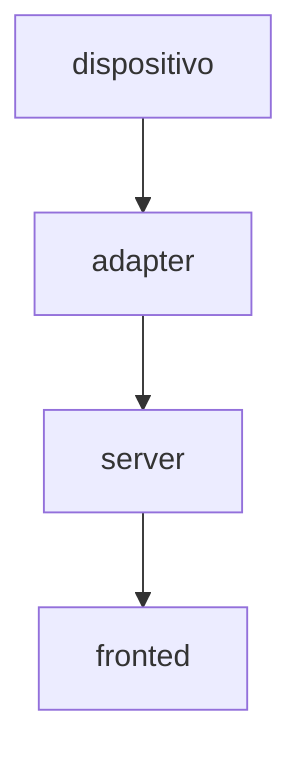

# Unidad 5
## Bitácora de proceso de aprendizaje
### actividad 1

-en esta actividad pasamos del protocolo de comunicacion ascii a un botocolo binario, las diferencia del binario al ascii que mientas para codificar en ascii usabamos 16 bytes para cada paquete de datos en el binaro solo usamos 6 bytes sin, embargo el proceso de codificacion es mas combicado 

-el protocola ascii no tenia problemas con la sincronizacion de los paquetes por el "\n" marcaba por asi decirlo cuando el fin los datos el programa lo detectaba y sabai que cuando habia un "\n" era por que finalizaba una trama e iniciaba otra

-el protocolo binario no se puede usar "\n" por que puede ser interpretado como otro dato mas

## Bitácora de aplicación 
### actividad 2

adapter binario

```js
const { SerialPort } = require("serialport");
const BaseAdapter = require("./BaseAdapter");

const HEADER = 0xAA;
const PACKET_SIZE = 8;

class MicrobitBinaryAdapter extends BaseAdapter {
  constructor({ path, baud = 115200, verbose = false } = {}) {
    super();
    this.path = path;
    this.baud = baud;
    this.verbose = verbose;
    this.port = null;
    this.buf = Buffer.alloc(0);
  }

  async connect() {
    if (this.connected) return;
    if (!this.path) throw new Error("serialPort is required for microbit device mode");

    this.port = new SerialPort({
      path: this.path,
      baudRate: this.baud,
      autoOpen: false,
    });

    await new Promise((resolve, reject) => {
      this.port.open((err) => (err ? reject(err) : resolve()));
    });

    this.connected = true;
    this.onConnected?.(`serial open ${this.path} @${this.baud}`);

    this.port.on("data", (chunk) => this._onChunk(chunk));
    this.port.on("error", (err) => this._fail(err));
    this.port.on("close", () => this._closed());
  }

  async disconnect() {
    if (!this.connected) return;
    this.connected = false;

    if (this.port && this.port.isOpen) {
      await new Promise((resolve, reject) => {
        this.port.close((err) => (err ? reject(err) : resolve()));
      });
    }

    this.port = null;
    this.buf = Buffer.alloc(0);
    this.onDisconnected?.("serial closed");
  }

  getConnectionDetail() {
    return `serial open ${this.path}`;
  }

  _onChunk(chunk) {
    // Acumular bytes entrantes en el buffer
    this.buf = Buffer.concat([this.buf, chunk]);

    // Procesar todos los paquetes completos que haya en el buffer
    while (this.buf.length >= PACKET_SIZE) {

      // Buscar el header 0xAA
      const headerIdx = this.buf.indexOf(HEADER);

      if (headerIdx === -1) {
        // No hay header en todo el buffer, descartarlo
        if (this.verbose) console.warn("[MicrobitBinary] No header found, discarding buffer");
        this.buf = Buffer.alloc(0);
        break;
      }

      if (headerIdx > 0) {
        // Hay bytes basura antes del header, descartarlos
        if (this.verbose) console.warn(`[MicrobitBinary] Discarding ${headerIdx} bytes before header`);
        this.buf = this.buf.slice(headerIdx);
      }

      // Verificar que haya suficientes bytes para un paquete completo
      if (this.buf.length < PACKET_SIZE) break;

      // Extraer el paquete
      const packet = this.buf.slice(0, PACKET_SIZE);

      // Calcular y verificar checksum: suma de bytes 1 a 6, módulo 256
      let sum = 0;
      for (let i = 1; i <= 6; i++) sum += packet[i];
      const expectedChk = sum % 256;
      const receivedChk = packet[7];

      if (expectedChk !== receivedChk) {
        console.warn(`[MicrobitBinary] Corrupted packet discarded — CHK received: ${receivedChk}, expected: ${expectedChk}`);
        // Descartar solo el header para buscar el siguiente paquete válido
        this.buf = this.buf.slice(1);
        continue;
      }

      // Parsear los campos del paquete
      const x    = packet.readInt16BE(1);
      const y    = packet.readInt16BE(3);
      const btnA = packet[5] === 1;
      const btnB = packet[6] === 1;

      this.onData?.({ x, y, btnA, btnB });

      // Avanzar el buffer al siguiente paquete
      this.buf = this.buf.slice(PACKET_SIZE);
    }

    // Prevenir que el buffer crezca indefinidamente
    if (this.buf.length > 4096) {
      console.warn("[MicrobitBinary] Buffer overflow, discarding");
      this.buf = Buffer.alloc(0);
    }
  }

  _fail(err) {
    this.onError?.(String(err?.message || err));
    this.disconnect();
  }

  _closed() {
    if (!this.connected) return;
    this.connected = false;
    this.port = null;
    this.buf = Buffer.alloc(0);
    this.onDisconnected?.("serial closed (event)");
  }

  async handleCommand(cmd) {
    if (cmd?.cmd === "setLed") {
      const x = Math.max(0, Math.min(4, Math.trunc(cmd.x)));
      const y = Math.max(0, Math.min(4, Math.trunc(cmd.y)));
      const v = Math.max(0, Math.min(9, Math.trunc(cmd.value)));
      await this._writeLine(`LED,${x},${y},${v}\n`);
    }
  }

  async _writeLine(line) {
    if (!this.port || !this.port.isOpen) return;
    await new Promise((resolve, reject) => {
      this.port.write(line, (err) => (err ? reject(err) : resolve()));
    });
  }
}

module.exports = MicrobitBinaryAdapter;
```

en el codigo del server solo se le quito las lineas que estaban como comentarios en la cabeza del codigo en la funcion de crear un adapter


## Bitácora de reflexión

paquete descartado, pruba con chk incorecto


### actividad 3

#### 1) comparacion ASCII vs binario

_Tamaño de paquetes de bytes_  


| ASCII        |    binario |
| ------------ | ---------- |
| 16 a 24 | 8 |

en el formato ASCII cada caracter vale un bytes por lo depedinedo de los valores de x, y puede aumentar o disminuir, mientra que en el binario los valores de x, y simpte son 2 bytes sin importar el valor  

_framing_  

| ASCII        |    binario |
| ------------ | ---------- |
| \n | 0xAA |  

osos son los mecanismos de delimitacion en el ASCII se usa el `\n` como delimitador terminal, por lo que si el programa detecta este caracter es el fin de una paquete, mientras que el binario usa la pocicion 0 de un paquete con el valor `0xAA` para indicar que aqui inica un paquete, aunque esto representa un problema dado que otro dato del paquete tambien podria tener este mismo valor pero para eso es el checksum ya que este verifica que los datos si coincidan.

_Checksum_  

| ASCII        |    binario |
| ------------ | ---------- |
| CHK = \|X\| + \|Y\| + A + B | CHK = (byte1 + byte2 + byte3 + byte4 + byte5 + byte6) % 256 |  

el **CHK** del ASCII verifica que los valores tengan sendito, sumando los bytes interpretados del  no verifica que la estructura o separacion de la trama tenga sentido, mientras que le **CHK** del binario suma los bytes crudo y la multiplicaion por el modulo asegura que el CHK valga un byte  

_Parsear_

en ASCII es mas facil parcear debido al uso del caracter `\n` y que estan separados por `|` mientras que en el binario `0xAA` puede aparecer dentro de los valores por lo que se requiere una logica extra para la sincronizacion, ademas de interpretar los datos en bytes

_depuracion_

en este aspecto el ASCII es mejor debido a que es legible en la terminal mientras que el binario es deberas decodificarlo para saber que es lo que dice un paquete

#### 2) arquitectura desacoplada

se pudo agregar un protocolo diferente sin modificar las otras capas por que el proyecto esta construido de forma de que cada capa tiene una funcion y un formato de salida definido, en este caso el adapter solo se encarga de emitir los datos no importa de que dispositivos, el server recive esos datos y los enruta, asi con cada capa, como se muestra en el siguiente flujo



#### 3) cual usar

el uso de un protocolo ASCII depende de las caracteristicas del proyecto que se este desarollando, como vimos este formato permite una facil depuracion y parceo por lo que seria util en un proyecto que necesitesmos realizar un constante monitorizacion, por otro lado el binario permite enviar datos en menos bytes por lo que seria util en un caso en el que tengamos que enviar muchos datos

#### 4) diagrama  


el brigdeServer fue lo unico modificado, ademas pues de agregar un nuevo adapter binario, lo demas el sketch, el fsm y el client no se modificaron


